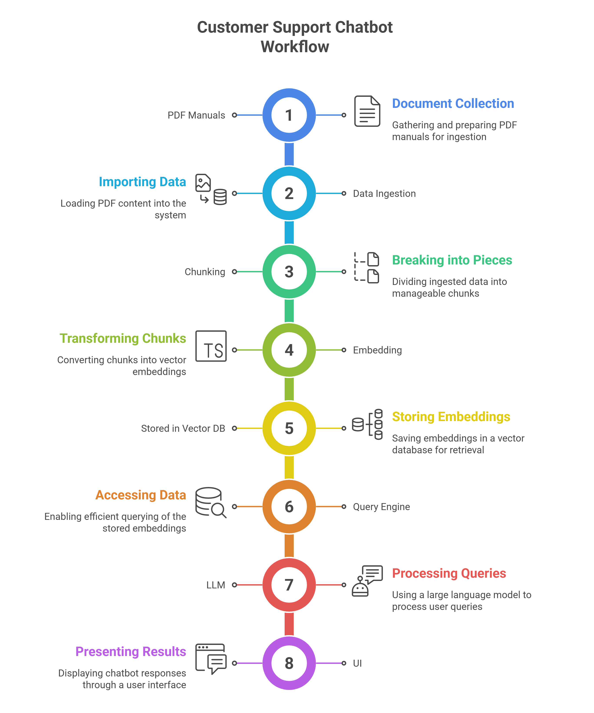
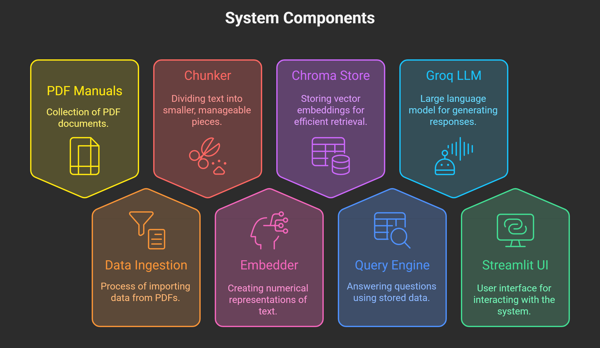

# OEM Ginie - GenAI-powered Customer Support Chatbot

**OEM Ginie** is a chatbot designed to assist technicians or staff using OEM manuals.  
This project currently includes the **Toyota Malaysia Fortuner OEM Manuals**.
A Retrieval-Augmented Generation (RAG) chatbot designed to automate customer support by answering queries from company documents, manuals, and FAQs. Built to reduce repetitive queries, improve response time, and enhance customer satisfaction.

## Project Overview
### Problem Statement: 
Customer support teams often spend a lot of time answering repetitive queries, leading to delays and inconsistent responses.

### Solution:
A RAG-based chatbot that leverages company documents, manuals, and FAQs to provide accurate responses while escalating complex queries to live agents.

### Key Achievements::
- Automated 60–70% of repetitive queries.
- Improved customer satisfaction (CSAT) scores.
- Reduced support team workload and response time.

## Features:
- Document Ingestion: Parses product manuals, company policies, and FAQs.

- Embeddings Database: Converts textual data into embeddings using transformer-based models.

- RAG Pipeline: Built with LangChain + Chroma for efficient retrieval and generation.

- Live Agent Escalation: Automatically routes complex queries to human support.

- Interactive Chat Interface: Can be deployed as a web or internal tool.

## Tech Stack
- Python

- LangChain – Orchestrates the RAG pipeline

- Chroma  – Vector database for embeddings

- HuggingFace Transformers – Embedding and LLM models

- Streamlit – Optional interface for chatbot

- Docker – Containerization for deployment

## Project Structure

```
oem_chatbot/
├─ src/
│  ├─ __init__.py
│  ├─ data_ingestion.py
│  ├─ chunker.py
│  ├─ embedder.py
│  ├─ vectorstore_chroma.py
│  ├─ query_engine.py
├─ app.py
├─ build_index.py        # CLI to (re)build DB
├─ requirements.txt
└─ README.md
```


## Application workflow

The overall application workflow is shown below:



## System Components


## Setup & Installation

1. Clone the repository:

```bash
git clone <your-repo-url>
cd oem_chatbot
```

2. Install required packages:

```bash
pip install -r requirements.txt
```

## Build Database

To ingest PDFs and build the vector database, run:

```bash
python build_index.py --pdf_folder data --persist_dir chroma_store
```

- `--pdf_folder`: Folder containing OEM manual PDFs  
- `--persist_dir`: Directory where the Chroma vector database will be stored

## Run Application

Launch the Streamlit app:

```bash
streamlit run app.py
```

The app will start a local server and you can interact with the OEM Ginie chatbot.

## Future Enhancements

- Multilingual support for global users.

- Advanced sentiment analysis for prioritizing queries.

- Integration with Slack, Teams, or WhatsApp for omni-channel support